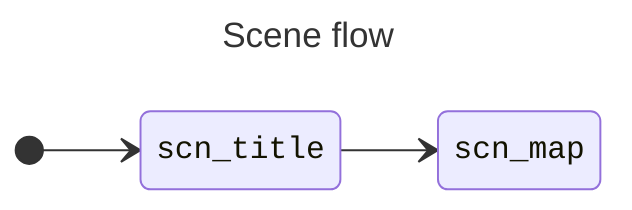

# Program design

This is my first C project after a while
and my first ambitious-ish game project for an 8-bit computer
and my mind is very tainted by a decade and a half of
[OOPs](https://www.youtube.com/watch?v=wo84LFzx5nI).
And we set up ourselves to do an RPG.
For a 3-month game jam.
We are not overscoping at all!

I don't know how to structure this thing,
so I'm experimenting a bit with the organization of this code
and writing down about it so that it doesn't get too spaghetti.

## Control flow

### src/main.c

Initializes structures and runs the game loop,
which refreshes [input](#srcinputc) state
and processes the "current [scene](#srcscene)."

### src/input.c

Calls GBDK's `joypad()` and sets a bunch of global booleans
about which buttons were pressed this frame, are being pressed, repeated, etc.

### src/scene/

`scene/manager.c` is sort of **state machine** for the whole game.
Calling it a "scene manager" just feels good, having had exposure to game
engines like Godot and having played with RPG Maker scripting,
but there's no scene graph or anything like that
(it might as well have been called "game_screens" or "game_states") &mdash;
scenes are just a bunch of function pointers,
with `process_fn` being the single mandatory one,
called every frame on the "current scene" when the main loop calls
`scene_process()`.

Scenes are kept in a stack and can either `scene_switch(s)` or `scene_call(s)`
another scene, passing a pointer to its `scene_desc`,
or `scene_return()` to the parent/caller scene.
The startup scene must be set by calling `scene_first(s)`
before any call to `scene_process()`.

The currently implemented scenes are:

- `scn_title`: The title screen.
- `scn_map`: A demo of a map with some units controlled by a cursor.

## Rendering

### src/STAT_in_WRAM.c (WIP)

Soon this will implement a reprogramable STAT ISR
to handle different scanline effects throughout the game.

Why reprogramable?
Why in WRAM?
Because I'm afraid that doing something as simple as
turning off the WIN at the start of a scanline with `LY=LYC`
requires an almost perfectly optimized sequence of SM83 instructions
to be fed to the processor,
so there aren't spare cycles for a nice ISR manager like GBDK's &mdash;
a `jmp` to somewhere might be all that I can afford.
But I'll want to use the STAT interrupt for other things!
So that somewhere must be in writable memory &mdash; WRAM or HRAM.
So I guess I'll be doing SMC on the Game Boy!

### src/ui.c

Manages a UI window that can be moved to the top or the bottom of the screen.

### src/game/map.c

This was supposed to hold "map state" for individual tiles,
but ended up just defining structs and methods to load and render the map
on the screen.

- [ ] I might move this into [src/data/model](#srcdatamodel-todo)

### src/game/unit.c (hmmm)

Loads and renders graphics for units on the field
and keeps a queue of commands for each of them that make each unit move.

### src/game/field.c (WIP)

I was thinking about making this as manager for game (not graphics) logic
and data for units in combat on the field.

This could store the player's and the opponent's party active units with their
grid positions, HP, status effects, etc.

## The _"Database"_

### res/

Contains PNGs that are processed by GBDK's `png2asset` into C files
with `#define`s and `extern` structs and arrays.

There are specific cases where I want to write some metadata that complements
the C generated by `png2asset`.
Currently, I'm writing it in sidecar C files,
(whose name start with the PNG filename's stem, like the generated C files,
followed by two underscores, then a name describing what the metadata is about)
that `#include` the generated files,
define the metadata needed by the game
(possibily with some macro hackery that derives structs
from the generated `#define`s)
and gets `#include`d in place of the former files.

I'm experimenting with moving these sidecar C files
into [src/data/](#srcdata-wip).

### src/data/ (WIP)

I'm thinking about putting the RPG's _"Database"_ here, as plain C structs.
It might include unit types, terrain types, stats, level tables, map metadata,
etc.

Gotta think about plans to develop tools or extend Tiled or Aseprite
to work on the data more visually and colaboratively.
I could start with writing some JSON or YAML or TOML and a quick Python script
for codegen.

### src/data/model/ (TODO)

C struct definitions for the _"Database."_

## Build system

The Makefile and directory structure is based on GBDK's "template_subfolders"
template,
but then I read the GNU Make manual
and wrote a number of convoluted hacks in
the Makefile.
It works, and builds the project from a clean slate state
in a single `make` invocation on Linux and Windows.
It could probably be rewritten in a simpler fashion.
